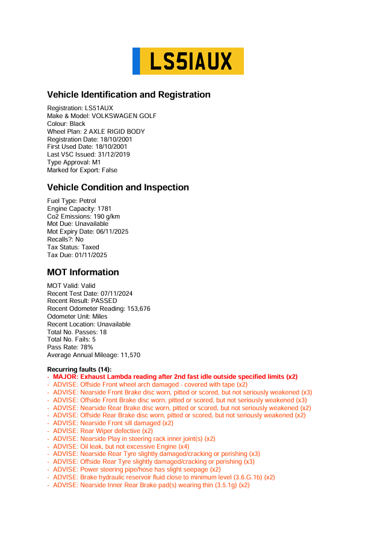
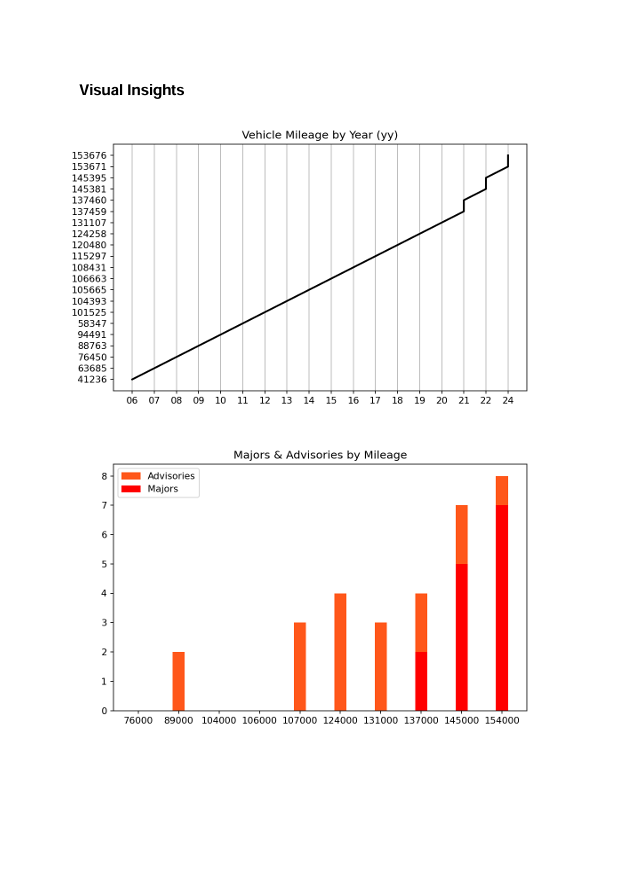
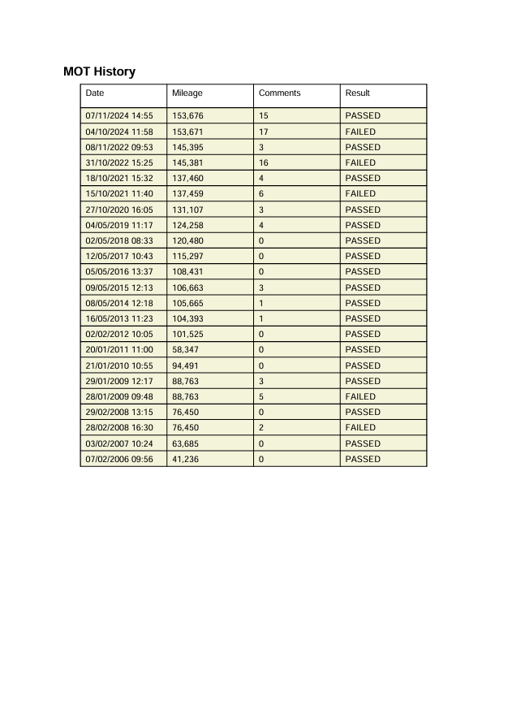

# Vehicle Lookup

This project leverages the [MOT History API](https://documentation.history.mot.api.gov.uk/) and the [Vehicle Enquiry Service](https://developer-portal.driver-vehicle-licensing.api.gov.uk/apis/vehicle-enquiry-service/vehicle-enquiry-service-description.html) to retrieve basic vehicle information and comprehensive MOT data. The gathered data is then formatted and presented in a PDF file. To use the API, you must apply for access and follow the steps outlined in the API documentation to obtain the necessary authorization details for making requests.

## Installation

To run this project on your local machine, follow these steps:

1. Clone or download the repository from [https://github.com/devharry20/Vehicle-Lookup](https://github.com/devharry20/Vehicle-Lookup).
2. Create a `.env` file and populate it with the following fields
```
MOT_API_KEY = MOT API key
MOT_AUTHORIZATION_KEY = MOT API bearer key
VES_API_KEY = Vehicle Enquiry Service API key
```
3. Install the required dependencies by running the command: `pip install -r requirements.txt`

## Important Notes
The MOT API provides limited data for newer vehicles, which is why many model fields are optional. New vehicles are MOT-exempt for the first 3 years, so MOT data will not be available for them until after their first test.

## Example 



